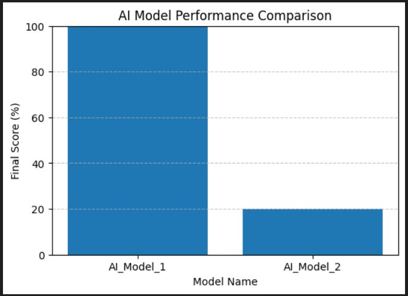

# 🧠 AI Data Reasoning Task Evaluator

This project simulates how AI models are evaluated for **reasoning and data-science skills**, inspired by [Project Agate (Pareto.AI)](https://pareto.ai/).  
It designs a realistic data-analysis challenge, generates synthetic data, and grades AI model responses automatically using a **rubric-based scoring system**.

---

## 🏥 Overview

The goal is to test an AI model’s ability to:
- Analyze tabular clinical-style data
- Compute correct metrics
- Reason about outcomes
- Generate interpretable recommendations

---

## ⚙️ What It Does

1. **Dataset Creation** → builds a synthetic hospital dataset (`patients.csv`)  
2. **Task Design** → defines realistic data reasoning questions  
3. **Model Simulation** → saves example AI model outputs (`model_output_sample.csv`)  
4. **Rubric Design** → defines weighted grading criteria (`rubric.csv`)  
5. **Automated Grading** → runs `grading_script.py` to score model outputs  
6. **Visualization** → generates bar charts comparing model performance  

---

## 🧾 Example Output

| Model Name | Final Score |
|-------------|--------------|
| AI_Model_1  | 100.0% |
| AI_Model_2  | 20.0%  |

---

## 📊 Visualization

Below is the comparison of AI model performance:



---

## 🧠 Tech Stack

- Python 3.10  
- pandas, numpy, matplotlib, jupyter  
- VS Code + Jupyter Extension  

---

## ▶️ How to Run

```bash
# 1. Clone or download this repo
git clone https://github.com/samuelnjerungari/ai-data-reasoning-evaluator
cd ai-data-reasoning-evaluator

# 2. Create & activate a virtual environment
python -m venv venv
venv\Scripts\activate

# 3. Install dependencies
pip install -r requirements.txt


💡 Why This Project Matters

As AI systems evolve, evaluating reasoning and workflow accuracy becomes essential for safe, aligned, and interpretable AI behavior.
This project demonstrates how to:

Design reasoning tasks

Build rubrics

Automate evaluation

Communicate results visually

👤 Author

Samuel Njeru Ngari
Clinical NLP & Annotation QA Specialist
🌐 GitHub Profile


GitHub Profile: https://github.com/samuelnjerungari
LinkeIn: www.linkedin.com/in/samuel-n-ngari


# 4. Run the grader
python grading_script.py
